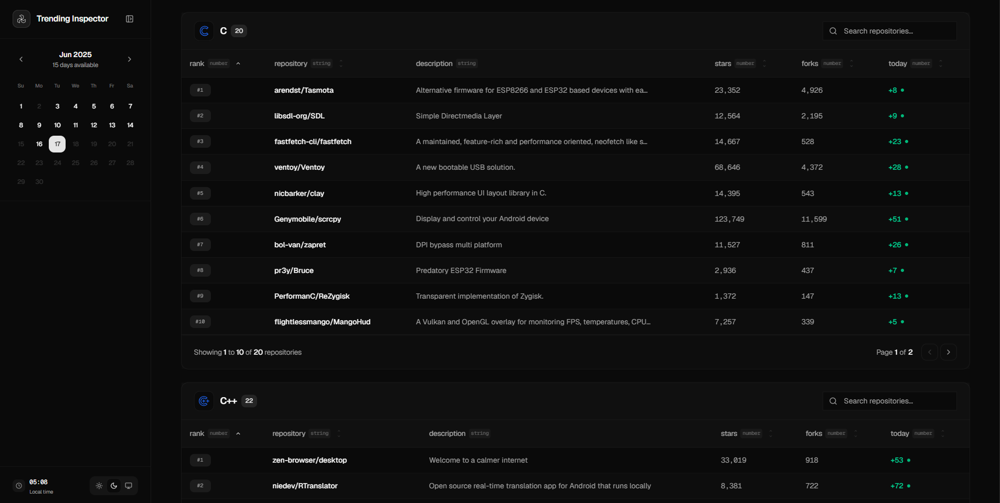
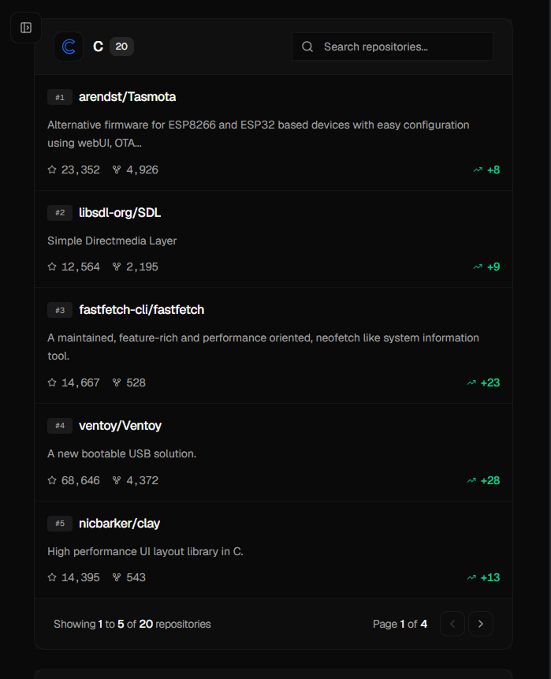

# github-trending-inspector

Browse trending repos by date. Interactive tables. Calendar selection.

## Overview

GitHub only shows today's trending. But what if you want to see what was hot last week? Last month? Historical context matters when tracking open source trends. Pick a date - see what was trending. Explore.

## Screenshots

  

  

## Data source

Powered by our GitHub Trending Scraper. Daily automated collection across 19 programming languages.

## License

MIT License
